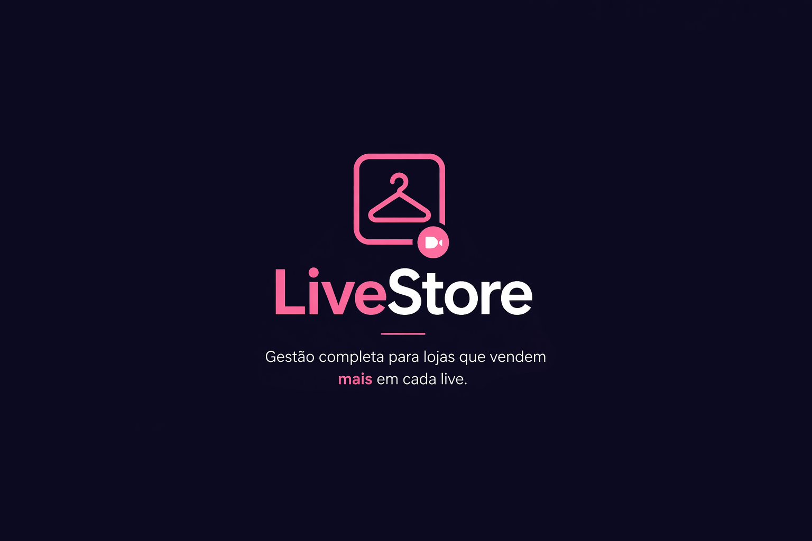

#  LiveStore - Sistema de Vendas por Live

Sistema web desenvolvido para gerenciar vendas realizadas durante transmissões ao vivo em uma loja de roupas.

---

##  Sobre o Projeto

O **Live Store** simula o fluxo de vendas em lives, onde a vendedora apresenta produtos e informa um código único.  
A cliente que digitar o código primeiro garante a compra.

O sistema funciona como um painel administrativo para organizar essas vendas de forma rápida e eficiente.

---

##  Funcionalidades

-  Cadastro de vendas em tempo real
-  Controle de estoque
-  Gerenciamento de clientes
-  Edição e exclusão de registros
-  Listagem com DataTables
-  Interface responsiva com sidebar moderna
-  Layout customizado (dark + identidade visual)

---

##  Tecnologias Utilizadas

- ASP.NET Core MVC (.NET 8/9)
- C#
- Entity Framework Core
- SQL Server
- Razor Pages
- Bootstrap (customizado)
- JavaScript
- jQuery
- DataTables

---

##  Arquitetura

O projeto segue o padrão **MVC**:

- **Models** → Estrutura de dados
- **Views** → Interface (Razor)
- **Controllers** → Lógica da aplicação
- **Data** → DbContext e acesso ao banco

---

##  Preview



---

## ⚙️ Como rodar o projeto

### 1. Clone o repositório

```bash
git clone https://github.com/SEU-USUARIO/NOME-DO-REPO.git
```

---

### 2. Acesse a pasta
```bash
cd NOME-DO-REPO
```

---

### 3. Configure o banco de dados

No arquivo appsettings.json, configure sua string de conexão:
```bash
"ConnectionStrings": {
  "DefaultConnection": "Server=SEU_SERVIDOR;Database=LiveStoreDB;Trusted_Connection=True;"
}
```

---

### 4. Execute as migrations
```bash
dotnet ef migrations add Inicial
dotnet ef database update
```

---

### 5. Rode o projeto
```bash
dotnet run
```

---

## Melhorias Futuras
- Sistema de produtos com código único por live
- Integração com chat em tempo real
- Controle de pagamentos
- Dashboard com métricas
- Sistema de autenticação (login)
- Aprendizados

---

## Esse projeto foi desenvolvido com foco em:

- prática de ASP.NET Core MVC
- integração com banco de dados
- construção de interfaces modernas
- aplicação de boas práticas de desenvolvimento

---

## Autor

Desenvolvido por João Pedro Vinhal

